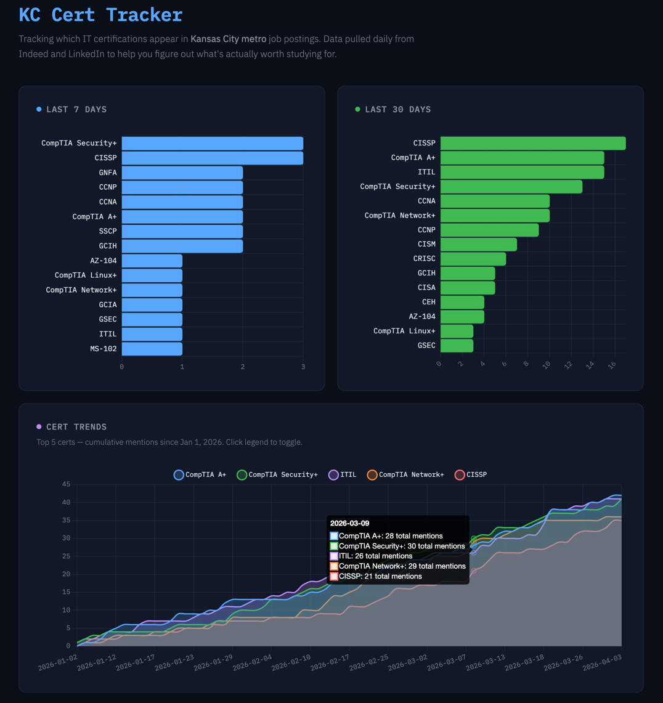

# KC Cert Tracker

**Live:** [kc-cert-tracker.fly.dev](https://kc-cert-tracker.fly.dev)

A full-stack data engineering application that tracks IT certification demand in the Kansas City metro area. An automated ETL pipeline collects job postings daily from LinkedIn and Indeed, extracts mentions of 80+ IT certifications, and serves the results through an interactive dashboard.

Built to answer a simple question for job seekers: **what certs are actually worth getting in KC right now?**



---

## Architecture
```
Job Board APIs (TheirStack)
        │
        │  Scheduled daily via GitHub Actions
        ▼
┌─────────────────────────────┐
│       ETL Pipeline          │
│                             │
│  Extract → Deduplicate →    │
│  Extract Certs → Aggregate  │
└──────┬──────────┬───────────┘
       │          │
       ▼          ▼
 Cloudflare R2   Neon PostgreSQL
 (Data Lake)     (Gold Layer)
       │                │
       │                ▼
       │         ┌────────────┐
       │         │  FastAPI   │
       │         │  (Fly.io)  │
       │         └─────┬──────┘
       │               │
       │               ▼
       │          Dashboard
       │       (Chart.js UI)
       │
  bronze/ → Raw JSON
  silver/ → Deduplicated + certs extracted
```

### Data Flow (Medallion Architecture)

| Layer | Storage | Format | Contents |
|-------|---------|--------|----------|
| **Bronze** | Cloudflare R2 | JSON | Raw API responses, unmodified |
| **Silver** | Cloudflare R2 | JSON | Deduplicated jobs with extracted certifications |
| **Gold** | Neon PostgreSQL | Tables | Aggregated daily cert counts for dashboard queries |

---

## Key Engineering Decisions

### Cross-Source Deduplication

The same job posting often appears on both LinkedIn and Indeed with different company names (e.g., "UMB Bank" vs "UMB Financial Corporation"), different formatting, and different metadata. Simple title + company matching catches almost none of these.

**Solution:** Content-based fingerprinting. Job descriptions are normalized (stripped of formatting, lowercased, non-alphanumeric replaced with spaces), then an MD5 hash is generated from characters 500–1500 — skipping company boilerplate intros and benefits/EEO footers to target role-specific content. Fingerprints expire after 21 days so recurring positions count as new demand.

Validated against production data: 100% recall on known duplicates with zero false positives.

### Certification Extraction

Regex pattern matching against 80+ certifications across CompTIA, Cisco, ISC2, ISACA, AWS, Azure, Google Cloud, GIAC/SANS, and more. Patterns account for variations in how certs appear in job descriptions (e.g., "Security+", "CompTIA Security", "Sec+").

---

## Tech Stack

| Component | Technology | Purpose |
|-----------|-----------|---------|
| **API** | FastAPI | REST endpoints + dashboard serving |
| **Database** | Neon PostgreSQL | Aggregated cert counts (gold layer) |
| **Object Storage** | Cloudflare R2 | Data lake (bronze + silver layers) |
| **Frontend** | Chart.js | Bar charts + cumulative trend visualization |
| **ETL** | Python + pandas | Extract, transform, deduplicate, load |
| **Scheduling** | GitHub Actions | Daily automated pipeline runs |
| **Deployment** | Fly.io + Docker | Containerized app with auto-deploy CD |
| **CI/CD** | GitHub Actions | Auto-deploy on merge to main |

---

## Dashboard

- **7-Day & 30-Day Views** — Rolling bar charts showing which certs are most in-demand right now
- **Cumulative Trends** — Area chart tracking the top 5 certs over time, showing demand growth since data collection began
- **Interactive** — Click legend labels to toggle individual certs on the trend chart

---

## Local Development

### Prerequisites

- Python 3.11+
- Docker Desktop

### Setup
```bash
git clone https://github.com/tbrennan339/kc-cert-tracker.git
cd kc-cert-tracker
python -m venv .venv
source .venv/bin/activate
pip install requests boto3 psycopg2-binary pandas python-dotenv fastapi uvicorn jinja2
```

Copy the environment template and fill in your credentials:
```bash
cp .env.example .env
```

Start local services:
```bash
make up        # PostgreSQL + MinIO via Docker Compose
```

Run the API:
```bash
uvicorn src.api.main:app --reload
```

Visit [http://localhost:8000](http://localhost:8000)

### Makefile Commands

| Command | Description |
|---------|-------------|
| `make up` | Start Docker Compose services |
| `make down` | Stop services |
| `make ps` | Show running containers |
| `make db-shell` | Open PostgreSQL shell |
| `make logs` | Tail container logs |

---

## Project Structure
```
kc-cert-tracker/
├── src/
│   ├── api/
│   │   ├── main.py              # FastAPI app + routes
│   │   ├── db/
│   │   │   └── queries.py       # Database query functions
│   │   └── templates/
│   │       └── dashboard.html   # Chart.js dashboard
│   ├── etl/
│   │   ├── run_pipeline.py      # Pipeline orchestrator
│   │   ├── extractors/
│   │   │   └── theirstack.py    # Job posting API client
│   │   ├── transformers/
│   │   │   ├── cert_extractor.py # Regex cert extraction
│   │   │   └── dedup.py         # Description fingerprinting
│   │   └── loaders/
│   │       ├── gold.py          # Aggregation + PostgreSQL loader
│   │       └── storage.py       # Cloudflare R2 uploader
│   └── config.py                # Centralized env configuration
├── scripts/
│   └── backfill.py              # Historical data backfill
├── infrastructure/
│   └── docker/
│       └── docker-compose.yml   # Local dev services
├── .github/
│   └── workflows/
│       ├── etl.yml              # Daily pipeline schedule
│       └── fly-deploy.yml       # Auto-deploy on merge
├── Dockerfile
├── fly.toml
└── Makefile
```

---

## CI/CD & Monitoring

- **CI** — GitHub Actions runs pytest on every pull request
- **CD** — Merging to main auto-deploys to Fly.io via GitHub Actions
- **Sentry** — Real-time error tracking and alerting
- **UptimeRobot** — Availability monitoring with 5-minute health checks

---

## Cost

Runs entirely on free tiers:

| Service | Free Tier       |
|---------|-----------------|
| Neon PostgreSQL | 0.5 GB storage  |
| Cloudflare R2 | 10 GB storage   |
| Fly.io | 3 shared VMs    |
| GitHub Actions | 2,000 min/month |
| TheirStack API | 200 req/month   |